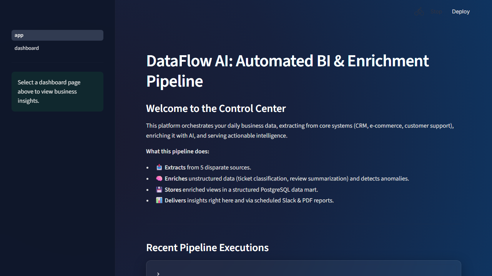
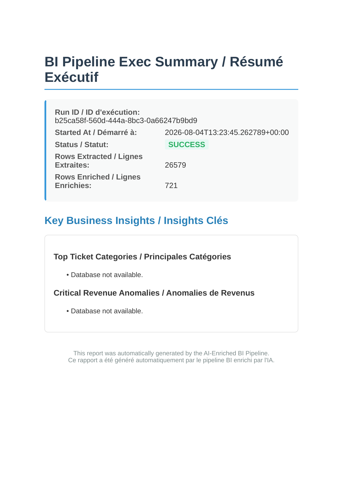

# Automated BI Pipeline with AI Enrichment (Sample-Data Portfolio Demo)

This is **Project 2** of the Remote AI Automation Strategy. It demonstrates a complete ETL data pipeline with AI enrichment, orchestrated via Apache Airflow, stored in PostgreSQL, and visualized with a dynamic Streamlit dashboard.

## 🎯 What This Product Does

Companies suffer from disjointed data reporting. This system:
1. **Extracts** data automatically from 5 simulated disparate sources (E-commerce, CRM, Support Tickets, Web Analytics, Product Reviews) via local CSVs to mimic API endpoints without needing live credentials.
2. **Transforms & Enriches** the data using Python (Pandas) and LLMs (Anthropic/OpenAI/Mock) to classify tickets, summarize reviews, detect anomalies, and enrich leads.
3. **Loads** the clean, enriched data into a structured PostgreSQL data mart.
4. **Delivers** actionable insights via a bilingual (English/French) Streamlit dashboard, automated PDF reports, and Slack alerts.

## 🏗️ Architecture & Technology Choices

- **Orchestration**: Apache Airflow. Chosen for robust scheduling, monitoring, and retries.
- **Backend/ETL**: Python 3.11 with `pandas`. Strong typing and declarative transforms.
- **Database**: PostgreSQL 16. Two schemas: `raw` (landed data) and `mart` (enriched views).
- **Frontend**: Streamlit. Fast to build, native Python, interactive data apps.
- **AI Layer**: Pluggable LLM enrichment (supports Anthropic Claude, NVIDIA NIM, Ollama) with a fallback `mock` mode to save costs during testing.
- **Infrastructure**: Docker Compose. Ensures complete environment reproducibility (Database, Orchestrator, Frontend).
- **PDF Generation**: WeasyPrint.

## 🚀 How to Run It Locally

1. **Clone the repository** and navigate to this folder.
2. **Environment Variables**:
   ```bash
   cp .env.example .env
   ```
   *Optional: Edit `.env` to add your Anthropic/NVIDIA API key and set `ENRICHMENT_MODE=llm` if you want real AI processing, otherwise it runs in `mock` mode.*
3. **Start the Stack**:
   ```bash
   docker-compose up -d --build
   ```
4. **Trigger the Pipeline**:
   - Open Airflow: [http://localhost:8080](http://localhost:8080) (user: `airflow`, password: `airflow`)
   - Unpause and trigger the `bi_pipeline` DAG.
5. **View the Dashboard**:
   - Open Streamlit: [http://localhost:8501](http://localhost:8501)
   - Toggle between French and English to see bilingual support in action.

## 🎯 Scope & Honest Portfolio Limitations

To ensure transparency for recruiters and engineers reviewing this portfolio:
- **Simulated External APIs**: The 5 distinct data sources are currently simulated via local CSV seed files. This allows reviewers to run the pipeline instantly without provisioning live credentials (e.g. Shopify, Zendesk, Salesforce) while still demonstrating real pandas transformations.
- **No Public Hosted Demo**: The Streamlit dashboard and Airflow UI currently run locally via Docker Compose. A live, publicly hosted demo link does not exist yet due to the ongoing costs of hosting the database and LLM endpoints for public traffic.

## 📸 Demo Walkthrough

### 1. Interactive BI Dashboard (Streamlit)

*The bilingual front-end dashboard connecting to the enriched PostgreSQL data mart.*

### 2. Automated PDF Reporting

*The automated summary generated at the end of every DAG run and distributed to stakeholders.*

## 🧪 How It Was Tested

- **Unit Testing**: `pytest` coverage for extraction logic, transformations, and mock enrichers.
- **Local Integration Testing**: Full end-to-end runs using Docker Compose, verifying that the database receives correct rows and the Streamlit dashboard renders without errors.
- **Mock Data Safety**: The system uses labeled `SAMPLE / DEMO` seed data, ensuring no real customer data is accidentally processed or exposed.

## 🚧 Known Tradeoffs

- **Upsert Logic**: For demo simplicity, the mart tables are truncated and repopulated during each run. In a production system with TBs of data, this would use `INSERT ... ON CONFLICT` or an incremental merge strategy.
- **Slack Webhooks**: The Slack webhook integration is fully functional via `requests`, but gracefully skips and logs to the console if a URL is not provided in `.env`.
- **Data Scale**: The seed data is deliberately small to keep Docker builds and LLM costs negligible.

## 🔐 Security & Cost Notes

- **No Secrets in Code**: All API keys, database passwords, and webhook URLs are injected via the `.env` file and excluded via `.gitignore`.
- **Cost Controls**: The pipeline defaults to `mock` mode which costs $0.00. `LLM_TIMEOUT` and `LLM_MAX_RETRIES` provide guardrails against runaway bills.
- **Read-Only Dashboard**: The Streamlit app connects to the PostgreSQL warehouse using a restricted `reader` role that only has `SELECT` permissions, preventing SQL injection mutations.
